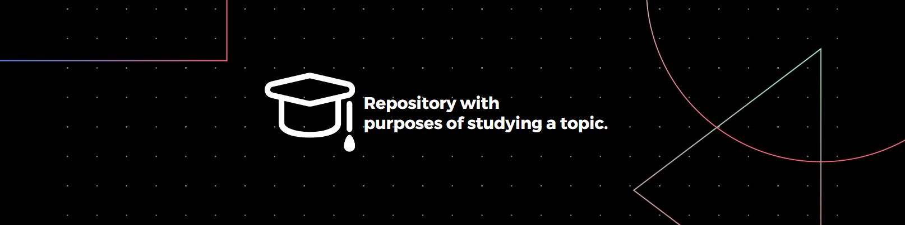

# 📚 Node stream foundation

Hey **\<T\>**, I hope that you like this study about "node stream foundation"\
that is reposable to deleiver a little pieces of data to optimize de data transaction\
making not nescessary wait all data arrive to save or handeling the information.

## 🎯 Goal

The goal of this project is discover about streams in node to handle the chunks\
during the process avoiding having to wait for all the information to arrive.

**NOTE: Attention! Since this is just a repository for study purposes, it may happen that \
some secondary processes are unfinished or not refined because they are not part of the\
proposed study scope, and the main objective has already been satisfactorily achieved.**

## 📬 Contact

Thank you to spend time reading my project and if there are any\
question or suggestion, you can find me in this medias bellow.

